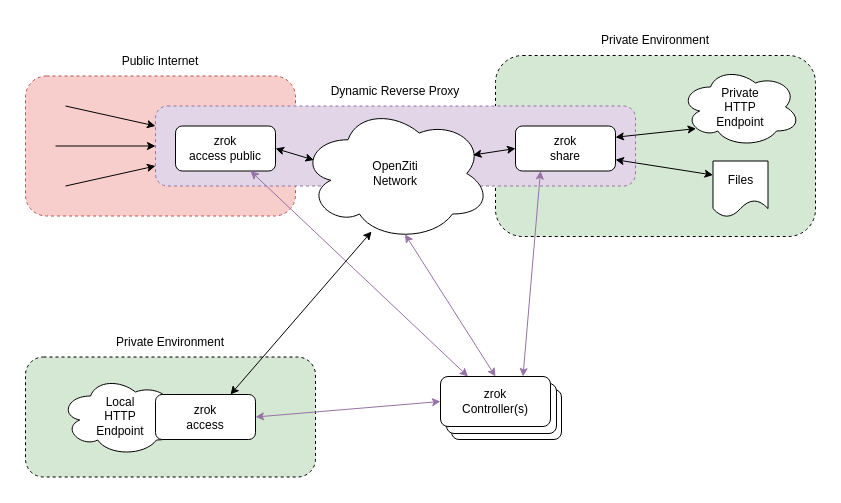

`zrok` is a next-generation sharing platform built on top of [OpenZiti](https://docs.openziti.io), a programmable zero-trust network overlay. `zrok` is an OpenZiti _Native Application_.

`zrok` facilitates sharing resources both publicly and privately, exposing them to an audience you can easily control.

Like other offerings in this space, `zrok` allows users to create ephemeral reverse proxies ("tunnels") for `http` resources. Additionally:

* `zrok` allows users to _privately_ share resources with other `zrok` users; in _private_ usage scenarios, your private resources are not exposed to any public endpoints; all communication is securely and privately transported between `zrok` environments
* `zrok` allows sharing other types of resources; rather than just proxying `http` endpoints, `zrok` allows users to easily and rapidly share files and web content
* `zrok` is ready to be extended to easily support many kinds of decentralized resource sharing; `zrok` provides a framework that makes this kind of peer-to-peer resource sharing simple and secure

## Frictionless

You can be up and sharing using the `zrok.io` service in minutes. Here is a synopsis of what's involved.

### First-time Setup

* Download the binary for your platform [here](https://github.com/openziti/zrok/releases)
* `zrok invite` to create an account with the service
* `zrok enable` to enable your shell environment for sharing with the service

### And then... sharing...

* `zrok share` to share resources immediately, simply and securely

See the [Concepts and Getting Started Guide](docs/getting-started/getting_started.md) for a full overview.

## Self-Hosting

`zrok` is designed to scale up to support extremely large service instances. `zrok.io` is a public service instance operated by NetFoundry using the same code base that is available to self-hosted environments.

`zrok` is also designed to scale down to support extremely small deployments. Run an OpenZiti network with `zrok` layered on top of it on a Raspberry Pi!

The single `zrok` binary contains everything you need to operate `zrok` environments and also host your own service instances. Just add an OpenZiti network and you're up and running.

See the [Self-Hosting Guide](docs/guides/v0.3_self_hosting_guide.md) for details on getting your own `zrok` service instance running. This builds on top of the [OpenZiti Quick Start](https://docs.openziti.io/docs/learn/quickstarts/network/) to have a running `zrok` service instance in minutes.

## Building

If you are interested in building `zrok` for yourself instead of using a released package, please refer to [BUILD.md](./BUILD.md)

## Contributing

If you'd like to contribute back to `zrok`, that'd be great. Please see our [CONTRIBUTING.md](./CONTRIBUTING.md) page and
abide by the [CODE_OF_CONDUCT.md](./CODE_OF_CONDUCT.md).