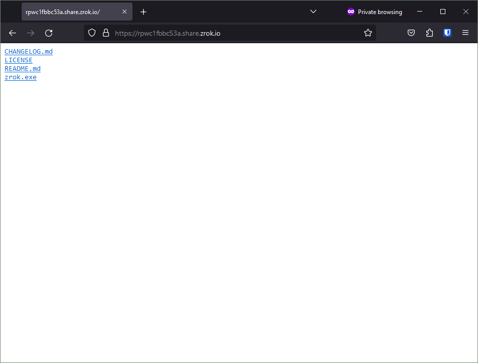
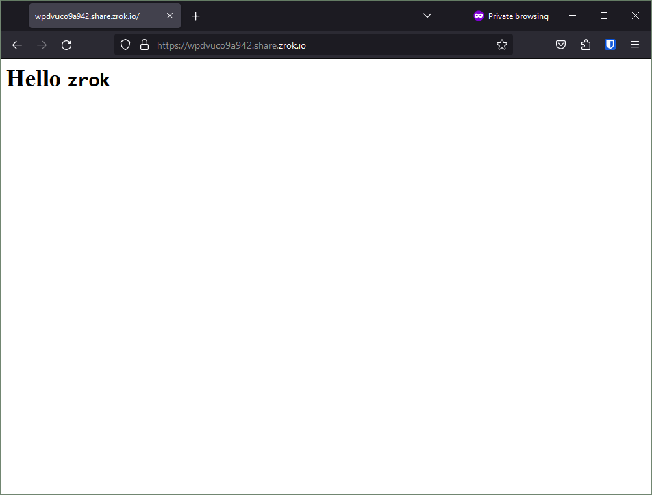

# Sharing Websites and Files

With `zrok` it is possible to share files quickly and easily as well. To share files using `zrok` use
the `--backend-mode web`, for example: `zrok share private . --backend-mode web`.

Running with this mode will make it trivially easy to share files from the directory which the command
was run from.

For example if you have a directory with a structure like this:
```shell
-rw-r--r--+ 1 Michael None     7090 Apr 17 12:53 CHANGELOG.md
-rw-r--r--+ 1 Michael None    11346 Apr 17 12:53 LICENSE
-rw-r--r--+ 1 Michael None     2885 Apr 17 12:53 README.md
-rwxr-xr-x+ 1 Michael None 44250624 Apr 17 13:00 zrok.exe*
```

The files can be shared using a command such as: 
```shell
zrok share public --backend-mode web .
```

Then the files can be access with a `private` or `public` share, for example as shown:



`zrok` will automatically provide a stock website, which will allow the accessing user to browse and navigate the file tree. Clicking the files allows the user to download them.

`zrok` can also share a pre-rendered static HTML website. If you have a directory like this:

```shell
-rw-rw-r--+ 1 Michael None 56 Jun 26 13:23 index.html
```

If `index.html` contains valid HTML, like this:

```html
<html>
<body>
        <h1>Hello <code>zrok</code></h1>
</html>
```

Sharing the directory will result in the following when you access the share in a web browser:

