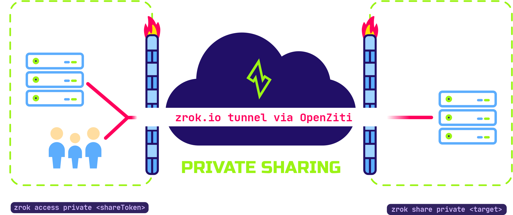

# Private Shares

`zrok` was built to share and access digital resources. A `private` share allows a resource to be 
accessed on another user's system as if it were local to them. Privately shared resources can only be accessed by another `zrok` user who has the details of your unique share. You are in control of who can access your `private` shares by sharing the the share token.

Peer-to-peer private resource sharing is one of the things that makes `zrok` unique.

`zrok` also provides `public` sharing of resources with non-`zrok` users. Public resource sharing is limited to only resources that can be accessed over `HTTP` or `HTTPS`. `private` sharing works with all of the resources types that `zrok` supports.

Here's how private sharing works:

# Peer to Peer

`private` shares are accessed using the `zrok access` command, and require the accessing user to have a `zrok enable`-d account on the same service instance where the share was created.

The `private` share is identified by a _share token_. The accessing user will use the share token, along with the `zrok access` command to create a local endpoint on their system, which lets them use the shared resource as if it were local to their system.

`zrok` does not require you to open any firewall ports or otherwise compromise the security of your local system; there is never an attack surface open to the public internet. As soon as you terminate the `zrok share` process, you immediately terminate any possible access to your shared resource.

The shared resource can be a development web server to share with friends and colleagues, a webhook from a server running in the cloud which has `zrok` running and has been instructed to `access` the private resource. `zrok` can also share files, websites, and low-level TCP and UDP network connections using the `tunnel` backend.  What matters is that the access to the shared resource is not done in a public way, and can only be accessed by other `zrok` users that have access to your share token.

The peer-to-peer capabilities of `zrok` are an important property of the underlying [OpenZiti](https://docs.openziti.io/docs/learn/introduction/) network that `zrok` uses to provide connectivity between users and resources.

Creating `private` shares is easy and is accomplished using the `zrok share private` command. Run `zrok share private` to see the usage output and to further learn how to use the command.