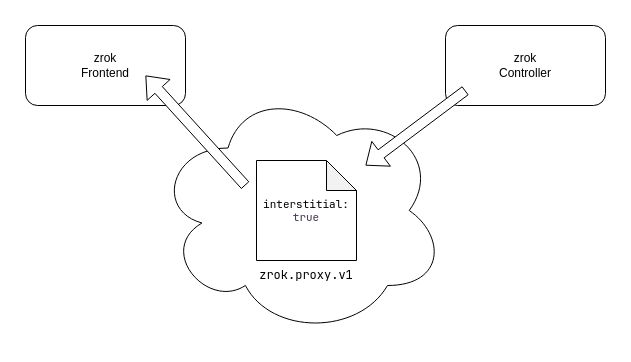

On large zrok installations that support open registration and shared public frontends, abuse can become an issue. In order to mitigate phishing and other similar forms of abuse, zrok offers an interstitial page that announces to the visiting user that the share is hosted through zrok, and probably isn't their financial institution.

Interstitial pages can be enabled on a per-frontend basis. This allows the interstitial to be enabled on open public frontends but not closed public frontends (closed public frontends require a grant to use). 

The interstitial page requirement can also be overridden on a per-account basis, allowing shares created by specific accounts to bypass the interstitial requirement on frontends that enable it. This facilitates building infrastructure that grants trusted users additional privileges.

By default, if you do not specifically enable interstitial pages on a public frontend, then your self-hosted service instance will not offer them.

Let's take a look at how the interstitial pages mechanism works. The following diagram shows the share configuration rendezvous made between the zrok controller and a zrok frontend:



Every zrok share has a _config_ recorded in the underlying OpenZiti network. The config is of type `zrok.proxy.v1`. The frontend uses the information in this config to understand the disposition of the share. The config can contain an `interstitial: true` setting. If the config has this setting, and the frontend is configured to enable interstitial pages, then end users accessing the share will receive the interstitial page on first visit.

By default the zrok controller will record `interstitial: true` in the share config _unless_ a row is present in the `skip_interstitial_grants` table in the underlying database for the account creating the share. The `skip_interstitial_grants` table is a basic SQL structure that allows inserting a row per account. 

```
create table skip_interstitial_grants (
    id          serial         primary key,

    account_id  integer        references accounts (id) not null,

    created_at  timestamptz    not null default(current_timestamp),
    updated_at  timestamptz    not null default(current_timestamp),
    deleted     boolean        not null default(false)
);
```

If an account has a row present in this table when creating a share, then the controller will write `interstitial: false` into the config for the share, which will bypass the interstitial regardless of frontend configuration. The `skip_interstitial_grants` controls what the zrok controller will store in the share config when creating the share.

The frontend configuration controls what the frontend will do with the share config it finds in OpenZiti. The new stanza looks like this:

```
# Setting the `interstitial` setting to `true` will allow this frontend 
# to offer interstitial pages if they are configured on the share by the 
# controller.
#
#interstitial: true
```

Simply setting `interstitial: true` in the frontend config will allow the configured frontend to offer an interstitial page if the share config enables the interstitial page for that share.

## Bypassing the Interstitial

The interstitial page will be presented unless the client shows up with a `zrok_interstitial` cookie. When the user is presented with the interstitial page, there is a button they can click which sets the necessary cookie and allows them to visit the site. The cookie is set to expire in one week.

End users can offer an HTTP header of `skip_zrok_interstitial`, set to any value to bypass the interstitial page. Setting this header means that the user most likely understands what a zrok share is and will hopefully not fall for a phishing attack.

The `skip_zrok_interstitial` header is especially useful for API clients (like `curl`) and other types of non-interactive clients.

The `drive` backend mode does not currently support `GET` requests and cannot be accessed with a conventional web browser, so it bypasses the interstitial page requirement.