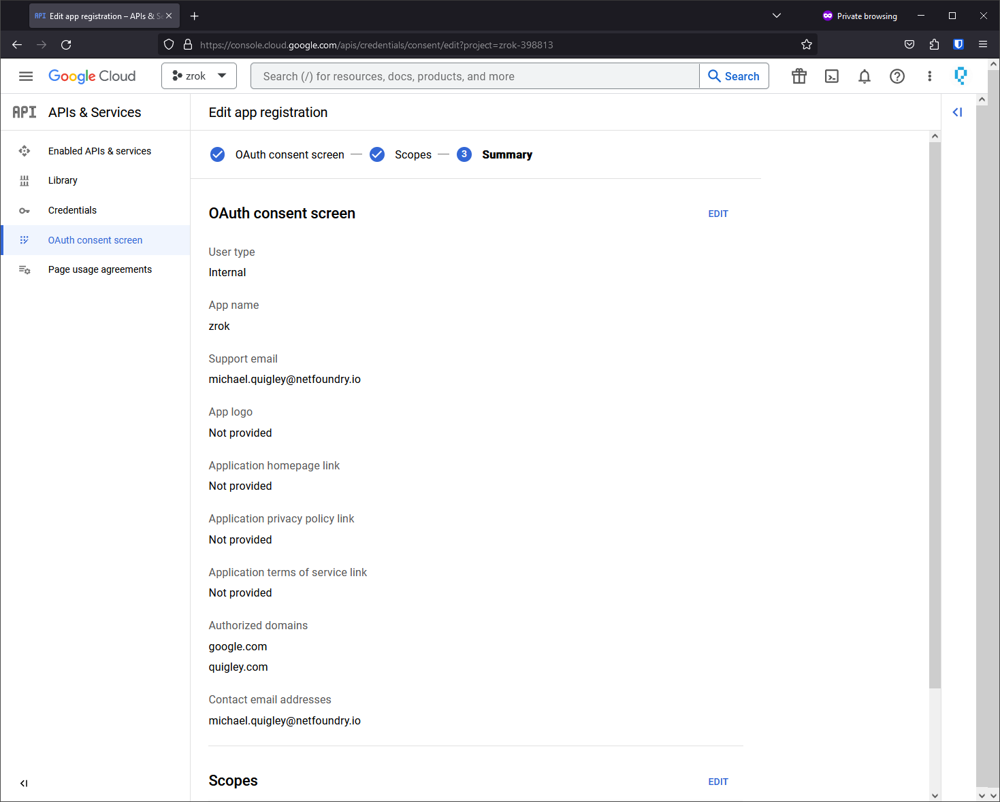
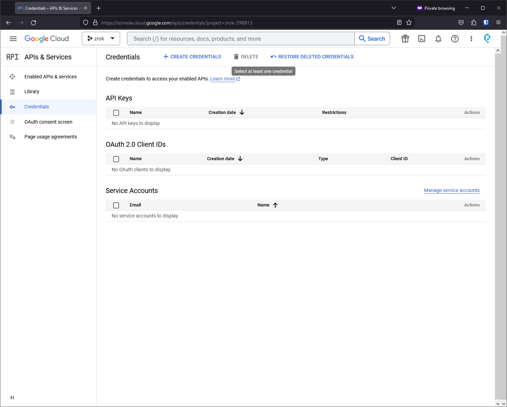
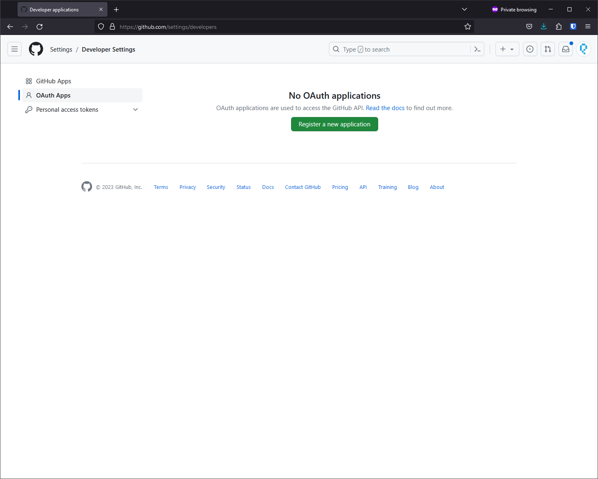
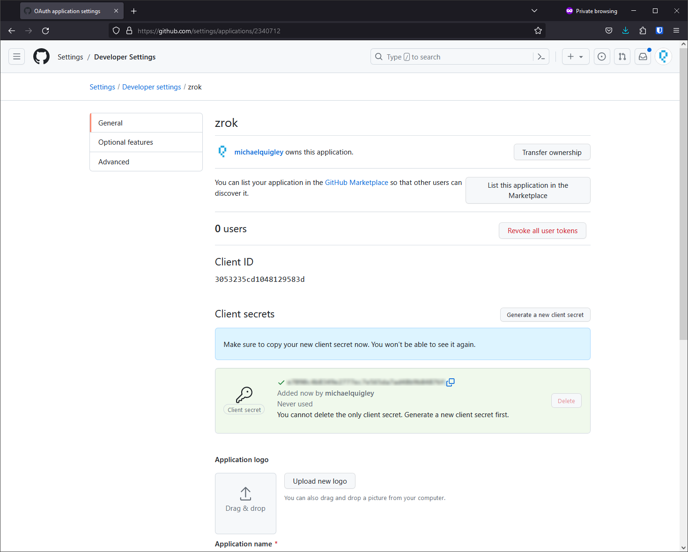

# OAuth Public Frontend Configuration

As of `v0.4.7`, `zrok` includes OAuth integration for both Google and GitHub for `zrok access public` public frontends. 

This integration allows you to create public shares and request that the public frontend authenticate your users against either the Google or GitHub OAuth endpoints (using the user's Google or GitHub accounts). Additionally, you can restrict the email address domain associated with the count to a list of domains that you provide when you create the share.

This is a first step towards a more comprehensive portfolio of user authentication strategies in future `zrok` releases.

## Planning for the OAuth Frontend

The current implementation of the OAuth public frontend uses a HTTP listener to handle redirects from OAuth providers. You'll need to configure a DNS name and a port for this listener that is accessible by your end users. We'll refer to this listener as the "OAuth frontend" in this guide.

We'll use the public DNS address of the OAuth frontend when creating the Google and GitHub OAuth clients below. This address is typically configured into these clients as the "redirect URL" where these clients will send the authenticated users after authentication.

The `zrok` OAuth frontend will capture the successful authentication and forward the user back to their original destination.

## Configuring a Google OAuth Client ID

### OAuth Content Screen

Before you can configure an OAuth Client ID in Google Cloud, you have to configure the "OAuth content screen". 

In the Google Cloud console, navigate to: `APIs & Services > Credentials > OAuth content screen`


Here you can give your `zrok` public frontend an identity and branding to match your deployment.


Describe what domains are authorized to access your public frontend and establish contact information.


Add a non-sensitive scope for `../auth/userinfo.email`. This is important as it allows the `zrok` OAuth frontend to receive the email address of the authenticated user.




Now your OAuth content screen is configured.

### Create the OAuth 2.0 Client ID

Next we create the OAuth Client ID for your public frontend.

In the Google Cloud Console, navigate to: `APIs & Services > Credentials > + Create Credentials`



Select `OAuth client ID` from the `+ Create Credentials` dropdown.


Application type is `Web Application`.


The most important bit here is the "Authorized redirect URIs". You're going to want to put a URL here that matches the `zrok` OAuth frontend address that you configured at the start of this guide, but at the end of the URL you're going to append `/google/oauth` to the URL.


Save the client ID and the client secret. You'll configure these into your `frontend.yml`.

With this your Google OAuth client should be configured and ready.

## Configuring a GitHub Client ID

Register a new OAuth application through the GitHub settings for the account that owns the application.

Navigate to:`Settings > Developer Settings > OAuth Apps > Register a new application`




The "Authorized callback URL" should be configured to match the OAuth frontend address you configured at the start of this guide, with `/github/oauth` appended to the end.


Create a new client secret.



Save the client ID and the client secret. You'll configure these into your `frontend.yml`.

## Configuring your Public Frontend

The public frontend configuration includes a new `oauth` section:

```yaml
oauth:
  redirect_host: oauth.zrok.io
  redirect_port: 28080
  redirect_http_only: false
  hash_key: "<yourRandomHashKey>"
  providers:
    - name: google
      client_id: <client-id>
      client_secret: <client-secret>
    - name: github
      client_id: <client-id>
      client_secret: <client-secret>
      
```

The `redirect_host` and `redirect_port` value should correspond with the DNS hostname and port configured as your OAuth frontend.

The `redirect_http_only` is useful in development environments where your OAuth frontend is not running behind an HTTPS reverse proxy. Should not be enabled in production environments!

`hash_key` is a unique string for your installation that is used to secure the authentication payloads for your public frontend.

`providers` is a list of configured providers for this public frontend. The current implementation supports `google` and `github` as options.

Both the `google` and `github` providers accept a `client_id` and `client_secret` parameter. These values are provided when you configure the OAuth clients at Google or GitHub.

## Enabling OAuth on a Public Share

With your public frontend configured to support OAuth, you can test this by creating a public share. There are new command line options to support this:

```
$ zrok share public
Error: accepts 1 arg(s), received 0
Usage:
  zrok share public <target> [flags]

Flags:
  -b, --backend-mode string               The backend mode {proxy, web, caddy} (default "proxy")
      --basic-auth stringArray            Basic authentication users (<username:password>,...)
      --frontends stringArray             Selected frontends to use for the share (default [public])
      --headless                          Disable TUI and run headless
  -h, --help                              help for public
      --insecure                          Enable insecure TLS certificate validation for <target>
      --oauth-check-interval duration     Maximum lifetime for OAuth authentication; reauthenticate after expiry (default 3h0m0s)
      --oauth-email-domains stringArray   Allow only these email domains to authenticate via OAuth
      --oauth-provider string             Enable OAuth provider [google, github]

Global Flags:
  -p, --panic     Panic instead of showing pretty errors
  -v, --verbose   Enable verbose logging
```

The `--oauth-provider` flag enables OAuth for the share using the specified provider.

The `--oauth-email-domains` flag accepts a comma-separated list of authenticated email address domains that are allowed to access the share.

The `--oauth-check-interval` flag specifies how frequently the authentication must be checked.

An example public share:

```
$ zrok share public --backend-mode web --oauth-provider github --oauth-email-domains zrok.io ~/public
```

