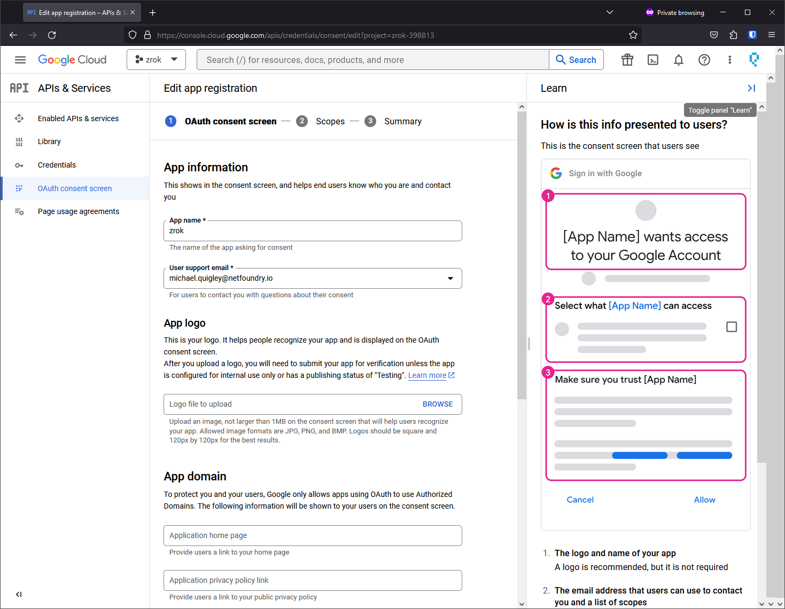
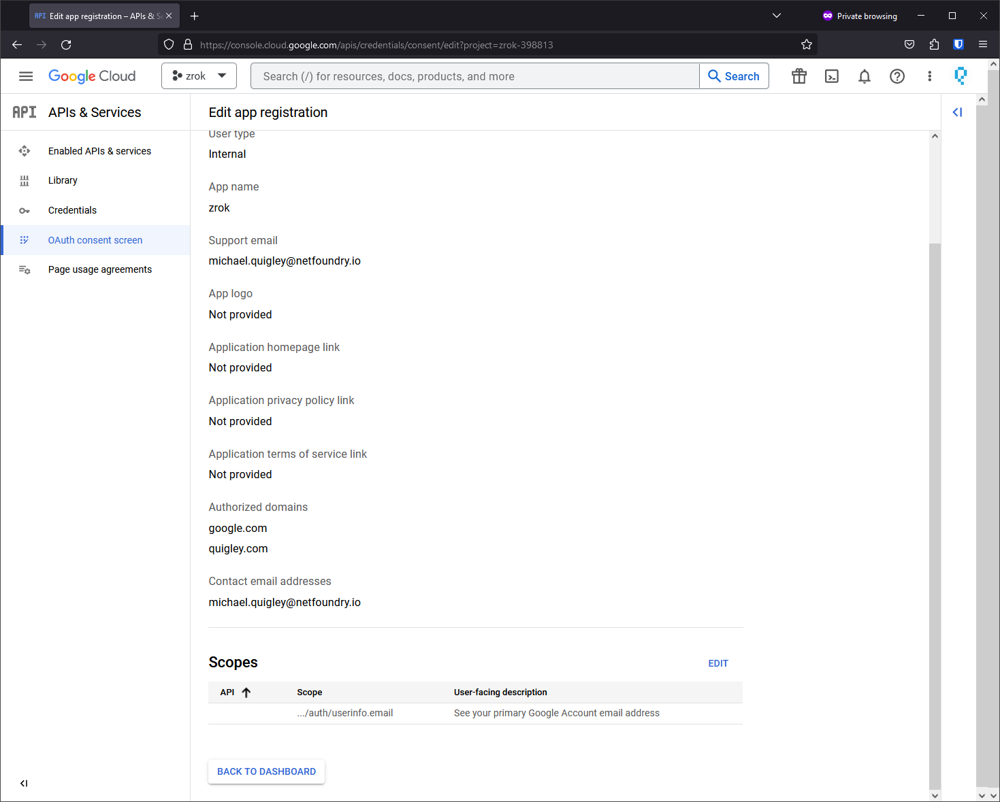
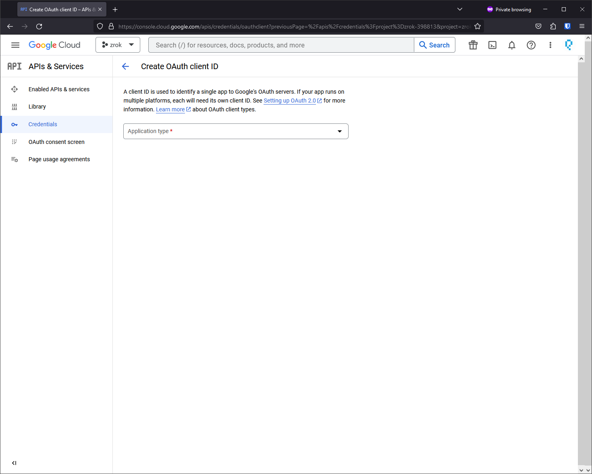
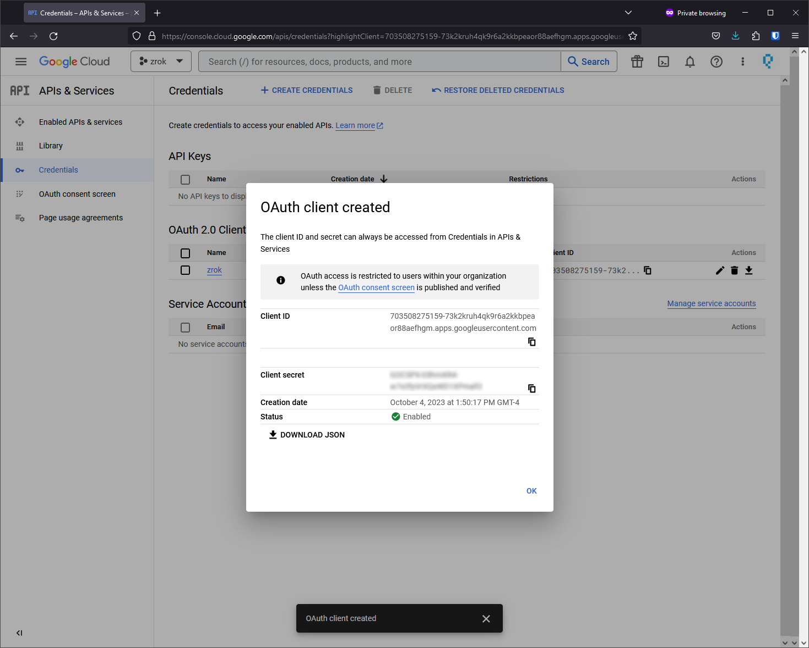
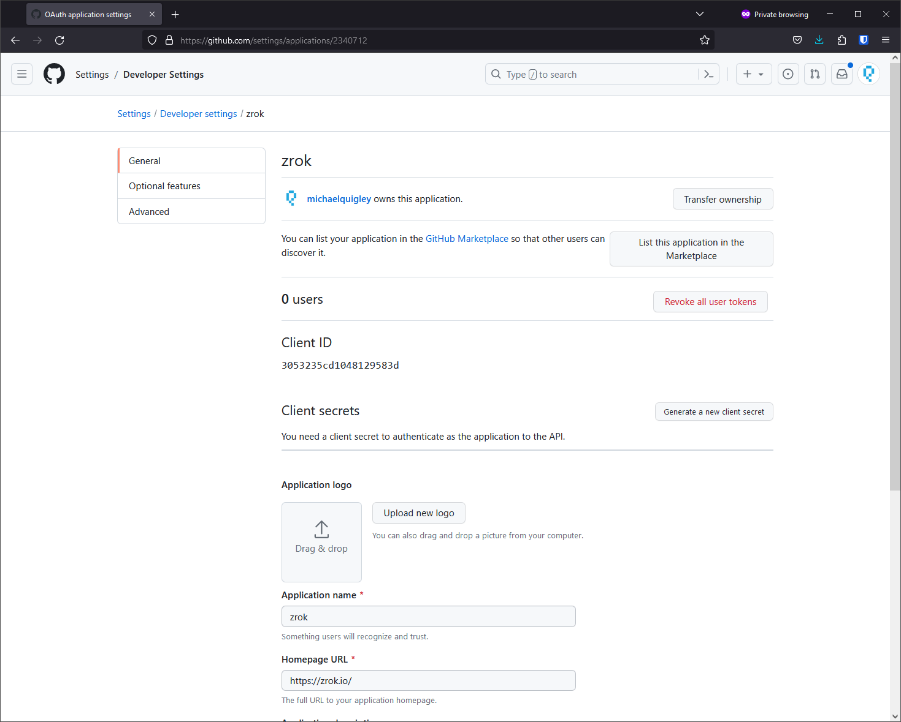

# OAuth Public Frontend Configuration

As of `v0.4.7`, `zrok` includes OAuth integration for both Google and GitHub for `zrok access public` public frontends. 

This integration allows you to create public shares and request that the public frontend authenticate your users against either the Google or GitHub OAuth endpoints (using the user's Google or GitHub accounts). Additionally, you can restrict the email address domain associated with the count to a list of domains that you provide when you create the share.

This is a first step towards a more comprehensive portfolio of user authentication strategies in future `zrok` releases.

## Planning for the OAuth Frontend

The current implementation of the OAuth public frontend uses a HTTP listener to handle redirects from OAuth providers. You'll need to configure a DNS name and a port for this listener that is accessible by your end users. We'll refer to this listener as the "OAuth frontend" in this guide.

We'll use the public DNS address of the OAuth frontend when creating the Google and GitHub OAuth clients below. This address is typically configured into these clients as the "redirect URL" where these clients will send the authenticated users after authentication.

The `zrok` OAuth frontend will capture the successful authentication and forward the user back to their original destination.

## Configuring a Google OAuth Client ID

### OAuth Content Screen

`APIs & Services > Credentials > OAuth content screen`




Add a non-sensitive scope for `../auth/userinfo.email`.




### Create the OAuth 2.0 Client ID

`APIs & Services > Credentials > + Create Credentials`


Select `OAuth client ID`



Application type is `Web Application`


Authorized redirect URIs:

Use the address of the OAuth frontend you configured above, but you're going to add `/google/oauth` to the end of the URL.



Save the client ID and the client secret. You'll configure these into your `frontend.yml`.

## Configuring a GitHub Client ID

`Settings > Developer Settings > OAuth Apps > Register a new application`


Authorization Callback URL: Use the address of the OAuth frontend you configured above, but add `/github/oauth` to the end of the URL.




Save the client ID and the client secret. You'll configure these into your `frontend.yml`.

## Enabling Oauth on Access Point

There is a new stanza in the access point configuration. 

```yaml
oauth:
  port: <host-port> #port to listen on oauth callbacks from
  redirect_url: <host-url> #redirect url to feed into oauth flow
  hash_key_raw: "<your-key>" #key we will use to sign our access token
  providers: #which providers we configure to use.
    - name: <provider-name>
      client_id: <client-id> #the client id you get from your oauth provider
      client_secret: <client-secret> #the client secret you get from your oauth provider
```
Currently we support the following Oauth providers:
- google
- github

In your oauth provider of choice's setup you would be prompted to create a client for accessing their services. It will ask for a redirect url. The format is: `<scheme>://<redirect_url>:<port>/<provider>/oauth` and as an example: `http://zrok.io:28080/google/oauth` This is also where you will find the client_id and client_secret.

The port you choose is entirely up to the deployment. Just make sure it is open to receive callbacks from your configured oauth providers.

redirect_url is what we will tell the oauth providers to callback with the authorization result. This will be whatever domain you've chosen to host the access server against without the scheme or port. This will get combined with the above port.

We then secure the response data within a zrok-access cookie. This is secured with the hash_key_raw. This can be any raw string.

### Required Scopes:
- google
- - Need access to a user's email: ./auth/userinfo.email 

### Example

An example config would look something like:
```yaml
oauth:
  port: 28080
  redirect_url: zrok.io
  hash_key_raw: "test1234test1234"
  providers:
    - name: google
      client_id: ohfwerouyr972t3riugdf89032r8y230ry.apps.googleusercontent.com
      client_secret: SDAFOHWER-qafsfgghrWERFfeqo13g 
```

Note that the client id and secret are jumbled text and do not correlate to actual secrets.

We spin up a zitadel oidc server on the specified port that handled all of the oauth handshaking. With the response we create a cookie with the name `zrok-access`.

## Enabling Oath on Share

To utilize the oauth integration on the access point we need to add a few more flags to our share command. There are three new flags:
- `provider` : This is the provider to authenticate against. Options are the same as above dependant on what the acess point is configured for
- `oauth-domains` : A list of valid email domains that are allowed to access the service. for example `gmail.com`
- `oauth-check-interval` : How long a `zrok-access` token is valid for before reinitializing the oauth flow. This is defaultly 3 hours.

That's all it takes!

Now when a user connects to your share they will be prompted with the chosen oauth provider and allowed based on your allowed domains. Simply restarting the service won't force a reauth for users either. Changing the `provider` or `oauth-check-interval` will, however. 