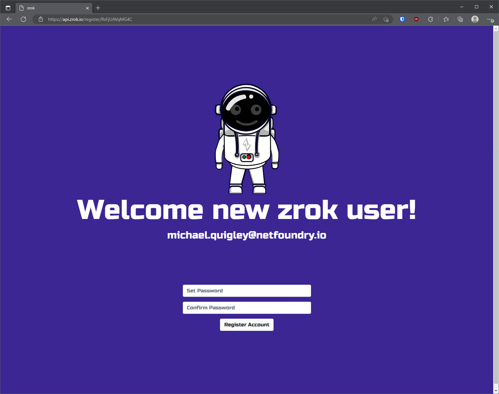
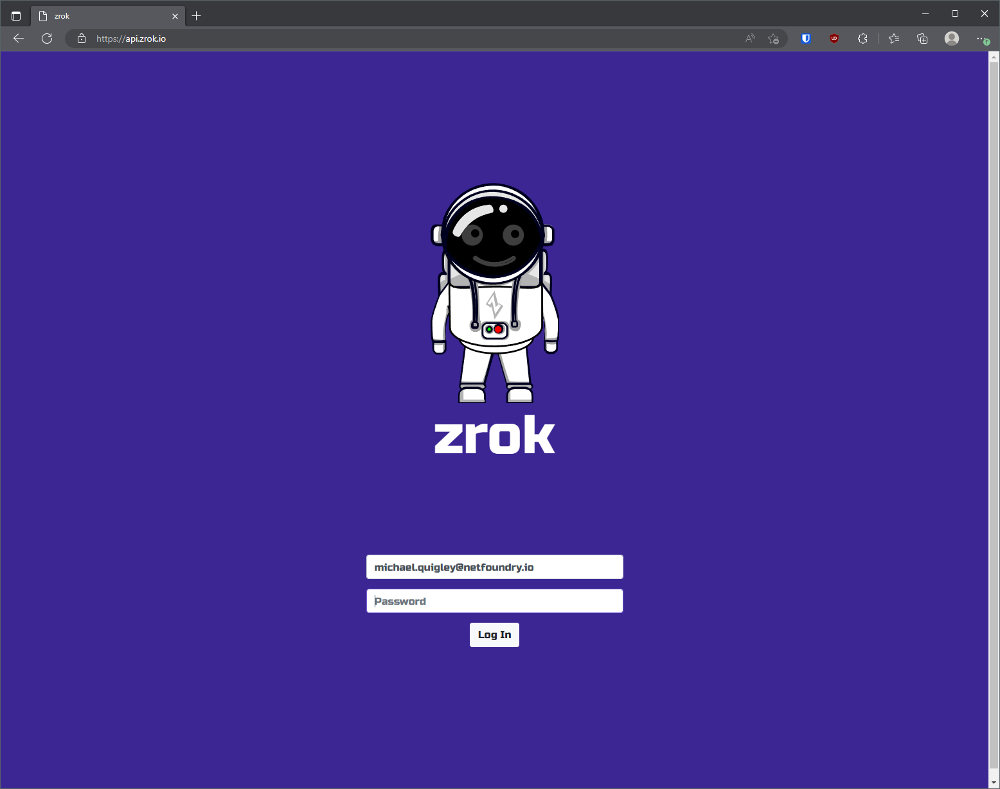

# Getting Started with zrok v0.3

`zrok` is a next-generation sharing platform built on top of [Ziti][openziti], a programmable zero trust network overlay. `zrok` is a _Ziti Native Application_.

`zrok` facilitates sharing resources publicly and privately with an audience of your choosing.

As of version `v0.3.0`, `zrok` provides users the ability to publicly proxy local `http`/`https` endpoints (similar to other players in this space). Additionally, `zrok` provides the ability to:

* _privately_ share resources with other `zrok` users; in _private_ usage scenarios, your private resources are not exposed to any public endpoints, and all communication is securely and privately transported between `zrok` clients
* use `web` sharing; easily share files with others using a single `zrok` command

Let's take a look at how to get started with `zrok`.

## Downloading zrok

In order to use `zrok`, you will need a `zrok` executable. [Download][zrok-download] a binary executable package for your platform at https://zrok.io/download.

### Extract zrok Distribution

Move the downloaded `zrok` distribution into a directory on your system. In my case, I've placed it in my home directory:

```
$ l zrok*
-rwxr-xr-x 1 michael michael 12724747 Jan 17 12:57 zrok_0.3.0-rc1_linux_amd64.tar.gz*
```

Create a directory where the extracted distribution will sit:

```
$ mkdir zrok
$ cd zrok/
```

Extract the `zrok` distribution:

```
$ tar zxvf ../zrok_0.3.0-rc1_linux_amd64.tar.gz
CHANGELOG.md
README.md
zrok
```

Add `zrok` to your shell's environment.

For Linux or macos:

```
$ export PATH=`pwd`:$PATH
```

For Windows (using Command Prompt):

```
> set PATH=%CD%;%PATH%
```

For Windows (using PowerShell):

```
$env:path += ";"+$pwd.Path
```

With the `zrok` executable in your path, you can then execute the `zrok` command from your shell:

```
$ zrok version
               _    
 _____ __ ___ | | __
|_  / '__/ _ \| |/ /
 / /| | | (_) |   < 
/___|_|  \___/|_|\_\

v0.3.0-rc1 [0d43b55]
```

## Configure Your zrok Service

`zrok` is both an installable utility that you interact with from your local computer, and also a service that exists on the network. NetFoundry operates the service that is available at `api.zrok.io`, but because `zrok` is open source and self-hostable, you're free to create your own `zrok` service.

The `zrok` executable defaults to using the `zrok` service at `api.zrok.io`. Should you need to change the service endpoint, you can do that with the following command:

```
$ zrok config set apiEndpoint https://staging.zrok.io
[WARNING]: unable to open zrokdir metadata; ignoring

zrok configuration updated
```

> The `WARNING` about `zrokdir metadata` is ignorable. Running the `zrok config set` command writes a small piece of metadata into a `.zrok` folder inside your home directory. This allows `zrok` to identify the version of its settings, providing a mechanism to upgrade your installation as new versions are released.

You can use the `zrok status` command to inspect the state of your local shell. `zrok` refers to each shell where you install and `enable` a copy of `zrok` as as an "environment".

```
$ zrok status

Config:

 CONFIG       VALUE                    SOURCE 
 apiEndpoint  https://staging.zrok.io  config 

[WARNING]: Unable to load your local environment!

To create a local environment use the zrok enable command.
```

> The `WARNING` about being `unable to load your local environment` will go away once you've done a `zrok enable` for your shell (we'll get to that below). For now, this warning is ignorable.

The `zrok status` command shows the configured API service that your environment is using, as well as the "source" where the setting was retrieved. In this case, `config` means that the setting was set into the environment using the `zrok config` command.

## Generating an Invitation

In order to create an account with the `zrok` service, you will need to create an invitation. 

> Some environments take advantage of "invitation tokens", which limits who is able to request an invitation on the service instance. If your service uses invitation tokens, the administrator of your instance will include details about how to utilize your token to generate your invitation.

We generate an invitation with the `zrok invite` command:

```
$ zrok invite

enter and confirm your email address...

> michael.quigley@netfoundry.io 
> michael.quigley@netfoundry.io 

[ Submit ]

invitation sent to 'michael.quigley@netfoundry.io'!
```

The `zrok invite` command presents a form that allows you to enter (and then confirm) your email address. Tabbing to the `[ Submit ]` button will send the request to your configured `zrok` service.

Next, check the email where you sent the invite. You should receive a message asking you to click a link to create your `zrok` account. When you click that link, you will be brought to a web page that will allow you to set a password for your new account:



Enter a password and it's confirmation, and click the `Register Account` button. You'll see the following:


For now, we'll ignore the "enable your shell for zrok" section. Just click the `zrok web portal` link:



After clicking the `Log In` button, you'll be brought into the `zrok` Web Console:


Congratulations! Your `zrok` account is ready to go!

## Enabling Your zrok Environment


[openziti]: https://docs.openziti.io/	"OpenZiti"
[ zrok-download]: https://zrok.io/download "Zrok Download"